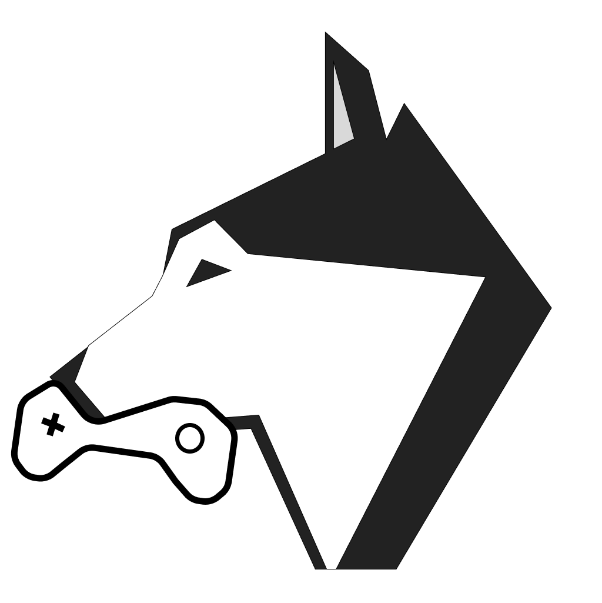

<p align="center">

</p>
<p align="center">
  <b>Gamium</b>
</p>
<p align="center">
Gamium is an SDK that allows you to automate gameplay
</p>

## Demo


## Description

Gamium provides the ability to script the behavior of game users. Starting from a simple function of clicking on the UI, you can automate various cases and be free from repetitive manual tests.

Automation starts when the gamium client sends a network message to the gamium engine for the specified command.
Users just need to put the gamium engine into the game build and send the specified message using the client sdk.

## Philosophy

As various platforms emerge, the number of things to test is increasing. Accordingly, the mobile app automation framework is used universally, but in the case of games, there are many projects where tests are not yet automated.

We want to solve this problem and develop automation library with multi-engine support through the same interface.
The interface we provide is inspired by Selenium and Playwright.

## Support List

### Engine

| Engine                | Windows / macOS | Android     | iOS         | Xbox         | PS4 / PS5    | Switch       |
| --------------------- | --------------- | ----------- | ----------- | ------------ | ------------ | ------------ |
| [Unity](engine/unity) | ✅              | ✅          | ✅          | Need testing | Need testing | Need testing |
| Unreal                | In progress     | In progress | In progress | Planned      | Planned      | Planned      |
| Godot                 | Planned         | Planned     | Planned     | Planned      | Planned      | Planned      |

### Proprietary Engine

| Language | Support |
| -------- | ------- |
| C++      | Planned |
| C#       | Planned |

### Client Language

| Language                               | Support |
| -------------------------------------- | ------- |
| [Typescript](client/typescript/gamium) | ✅      |
| [Python](client/python/gamium)         | ✅      |
| C#                                     | Planned |


## Getting Started
Please refer to the [Get Started](https://gamium.dogutech.io/docs/get-started/introduction)

## Installation

[npm](https://www.npmjs.com/package/gamium)
```
npm i gamium
```

[pip](https://pypi.org/project/gamium/)
```
pip install gamium
```


## Examples

You can look up the UI and then click and scroll,

```ts
await gamium.ui().click(By.path('/Canvas[1]/Login[1]/Panel[1]/GuestLoginBtn[1]'));
```

You can simulate input into the game,

```ts
await gamium.sendKey(KeyBy.unityKeyboard('Space'));
```

You can also call specific functions.

```ts
await gamium.executeRpc(RpcBy.method('Gamium.Private.CodebaseSample', 'CallParam1', 10));
```

## Look at Resources

[Documentation](https://gamium.dogutech.io)  
[Blog](https://blog.dogutech.io/tag/gamium/)

## Join the Community
[Discord](https://discord.gg/cUWPGWgUFG)

## Build Testing Platform With Dogu

If you want to build game test automation infra such as device farm, reporting test, test pipeline then you can start to build with [Dogu](https://github.com/dogu-team/dogu-platform)


## Contributing
Please, don't hesitate to [file a question](https://github.com/dogu-team/gamium/discussions/new?category=q-a).

If you have problem, [file an issue](https://github.com/dogu-team/gamium/issues/new).  
If you are interested in contributing directly to the code base, don't hesitate to [Pull request](https://github.com/dogu-team/gamium/pulls).  
But I'd really appreciate it if you could read the [CONTRIBUTING.md](CONTRIBUTING.md) before making your request.

## License

Gamium is [MIT licensed](LICENSE)
