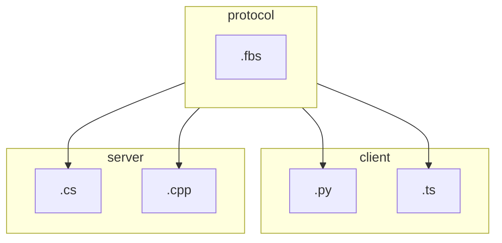

# Protocol Development

#### Control protocol

The Gamium Client communicates continuously to control the Gamium Engine. To this end, the Gamium Client and Gamium Engine share a protocol for communication. This protocol was defined using [FlatBuffers](https://google.github.io/flatbuffers/).  
Protocols defined through ".fbs" files are extracted in various languages, and the extracted protocols are used by Gamium Client and Gamium Engine.



:::info
Flatbuffer is a binary serialization format that allows you to create a schema for your data and then compile it into a binary format that can be used in many different programming languages.  
:::

:::danger
If you change the Gamium protocol, all engine and client interfaces must be checked.
:::

#### Define schema

The schema files is located in the `protocol/fbs` folder.  
Please refer to [**Flatbuffer official schema document**](https://flatbuffers.dev/flatbuffers_guide_writing_schema.html) for the grammar of flatbuffer.

#### Export protocol

```sh
cd protocol
yarn export
```

#### Update Unity meta files

```sh
cd utils/typescript/unity-meta-gen
yarn export
```
