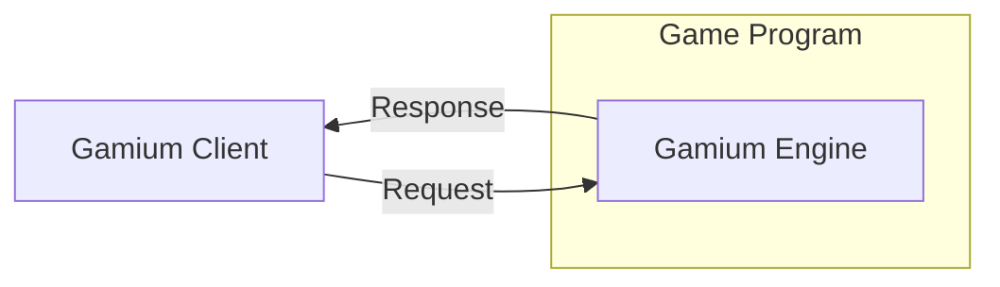

# Introduction

`Gamium`is an SDK that can automate gameplay. Gamium provides the ability to script the behavior of game users.
Starting with the simple ability to click on the UI, you can automate a variety of cases and free yourself from repetitive manual testing.

To simulate Gamium gameplay, we developed two components: [`Gamium Engine`](#gamium-engine) and [`Gamium Client`](#gamium-client).
Include the `Gamium Engine` in your game build, and use the API provided by the `Gamium Client` to write your preferred test script

### Gamium Engine

The `Gamium Engine` is responsible for executing the status of the game according to the request, such as virtual input. Start preparing to run the test, including the `Gamium Engine SDK` in the game build.

The `Gamium Engine SDK` has an SDK for each engine and must use the SDK for the game you want to test.

- [Unity](../engine/unity/project-configuration)

### Gamium Client

`Gamium Client` is a client that communicates with `Gamium Engine`.
You can request virtual input such as a game status query, keyboard, mouse, etc. You can mix virtual inputs and conditional statement iterations to script the inputs in the flow you want. Create and run scripts to automate the tests you want.

The `Gamium Client SDK` has an SDK for each language, and you must use the SDK that matches the language you want to create.

- [Typescript](../client/write-testscript)

### Diagram

