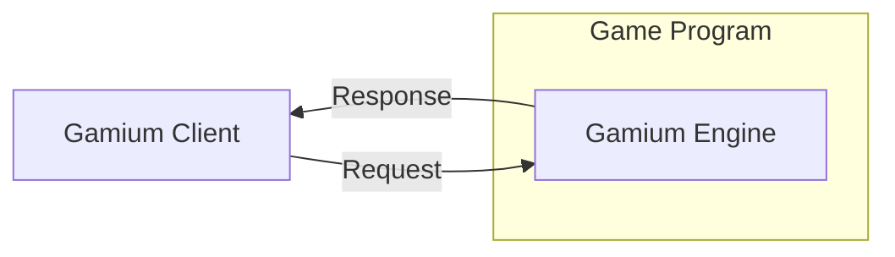

# 소개

`Gamium`은 게임플레이를 자동화할 수 있는 SDK입니다. `Gamium` 통해 게임유저의 행동을 스크립트화할 수 있는 기능을 제공합니다.
UI를 클릭하는 단순한 기능부터 시작해 다양한 케이스를 자동화하고 반복적인 수동테스트로부터 자유로워질 수 있습니다.

`Gamium` 게임 플레이를 시뮬레이션 하기위해 [`Gamium Engine`](#gamium-engine)와 [`Gamium Client`](#gamium-client)라는 두 가지 컴포넌트를 개발했습니다.  
`Gamium Engine`를 게임빌드에 포함하고, `Gamium Client`가 제공하는 API를 사용하면 원하는 테스트 스크립트를 작성할 수 있습니다.

### Gamium Engine

`Gamium Engine`는 게임의 상태를 가상입력 등의 요청을 받으면 요청에 맞게 실행하는 역할을 합니다. 게임빌드에 `Gamium Engine SDK`를 포함하여 테스트 실행을 위한 준비를 시작해보세요.

`Gamium Engine SDK`는 엔진별로 SDK가 있으며, 테스트하고자 하는 게임에 맞는 SDK를 사용해야 합니다.

- [Unity](gamium-engine/unity/project-configuration)

### Gamium Client

`Gamium Client`는 `Gamium Engine`과 통신하는 Client 입니다.
게임 상태 조회, 키보드, 마우스 등의 가상입력을 요청할 수 있습니다. 가상입력과 조건문 반복문을 섞어서 원하는 흐름대로 입력을 스크립트화 할 수 있습니다. 스크립트를 작성하고 실행하여 원하는 테스트를 자동화해보세요.

`Gamium Client SDK`는 언어별로 SDK가 있으며, 작성하고자 하는 언어에 맞는 SDK를 사용해야 합니다.

- [Typescript](gamium-client/write-testscript)

### Diagram

